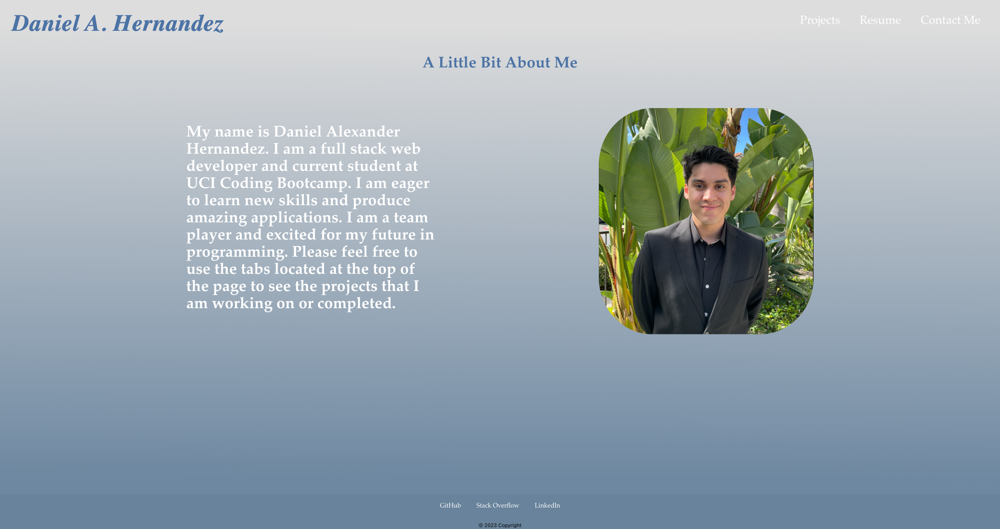

# React Portfolio

#### Daniel Alexander Hernandez

 

## Technologies Used
<ul>
    <li>Javascript</li>
    <li>React</li>
</ul>

 

## Description

This is an application created with React to showcase a porfolio of myself including an About Me page, a Project page which demonstrates some of my applications that I previously worked on. A Resume page that houses a link to my resume and a Contact Me page which holds a form for anyone to leave their information to get in tough with me.

 
 

## Installation

To get this application working, simply visit the deployed link listed below.

https://danalexanderh.github.io/react-portfolio/

 

## Usage

This is a very simple application, all users need to do is click on any of the navigation tabs to be directed to the corresponding page.

